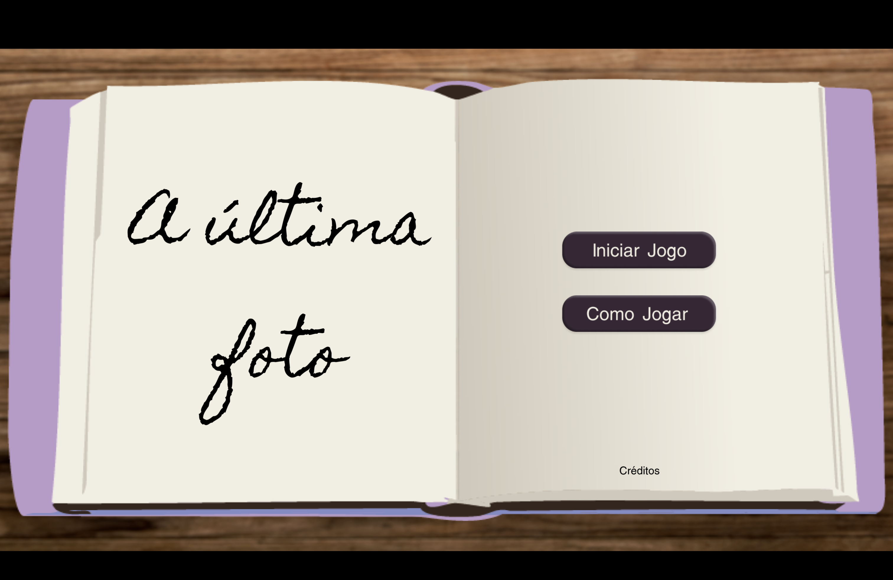
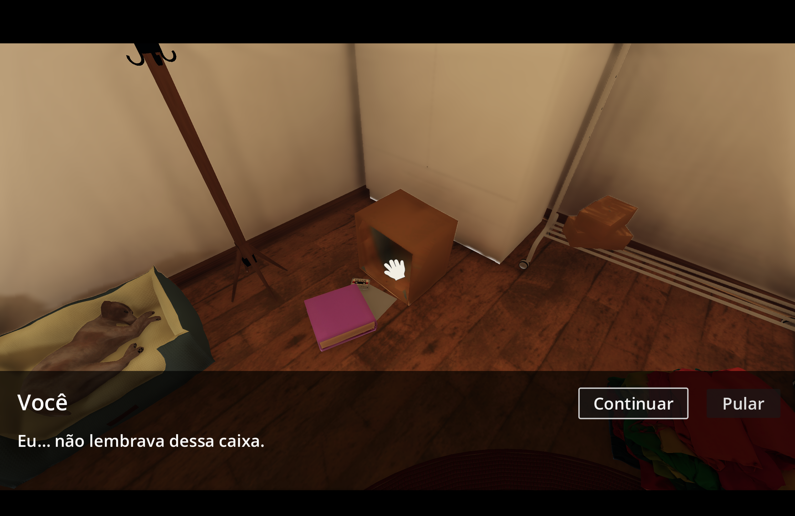
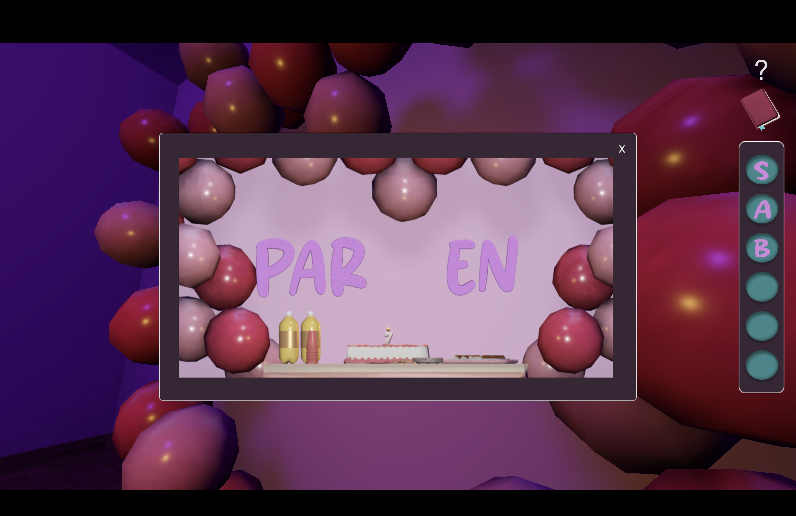

# A Última Foto

---

## 🎮 Sobre o Jogo

**A Última Foto** é um jogo de *escape room* 3D desenvolvido para **MacBook**, que combina puzzles 2D integrados ao ambiente com exploração em primeira pessoa.

Com um estilo semi-realista e forte foco em **atmosfera** e **raciocínio lógico**, o jogo se passa em um cenário tipicamente brasileiro: um aniversário dos anos 2000, repleto de elementos nostálgicos que ajudam a construir a narrativa e os desafios.

---

## 🖼️ Preview do Jogo

  
  

  
  

---

## ✨ Features

### 🧩 Puzzles Integrados
- Resolva desafios 2D incorporados ao ambiente 3D  
- Interaja com objetos para desbloquear novas pistas

### 🌆 Exploração Imersiva
- Navegue por um ambiente fechado em estilo *escape room*  
- Descubra segredos escondidos no cenário  
- Interaja com elementos distribuídos pelo espaço  

### 🇧🇷 Ambientação Brasileira
- Cenário inspirado em aniversários brasileiros dos anos 2000  
- Elementos culturais e visuais que reforçam a imersão  
- Atmosfera nostálgica como parte da experiência  

---

## 🛠️ Tecnologias Utilizadas

- 💗 **Godot Engine (3D)**
- 💗 **GDScript**
- 💗 **Design de Puzzles**
- 💗 **Level Design**

---

## 👥 Equipe

Este projeto foi desenvolvido em colaboração com:

- Isabella Brum  
- Julia Oliveira  
- Gabriella Tomoda  
- Isabel Cristina  
- Ana Macedo  

---

## 🔗 Repositório

